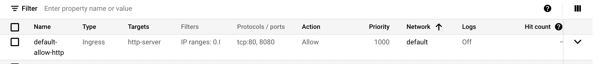

## Jenkins docker image installation Ubuntu 22.04

- Full list of installation parameters: [see] (https://hub.docker.com/_/jenkins/)

```
sudo apt update && sudo apt upgrade
```

- Installing Jenkins
```
sudo mkdir -p /var/jenkins_home
```
```
sudo chown -R 1000:1000 /var/jenkins_home/
```
```
sudo docker run -p 8080:8080 -p 50000:50000 -v /var/jenkins_home:/var/jenkins_home --name jenkins -d jenkins/jenkins:lts
```

- Open browser and go to: http://IP:8080/ (change IP to your server IP or damin name)
 

- Incase it does not load check firewall rules allowing port 8080 as example in 
 

- You will be asked for initial password for the Jenkins, you can get this password by entering following command on your server.

```
sudo cat /var/jenkins_home/secrets/initialAdminPassword
```
- Install suggested plugins

- A screen with “Create First admin User prompt” will appear. You will need to enter a username, password, full name and email address.


- Go back to first page                                                                                            [home](../README.md)

